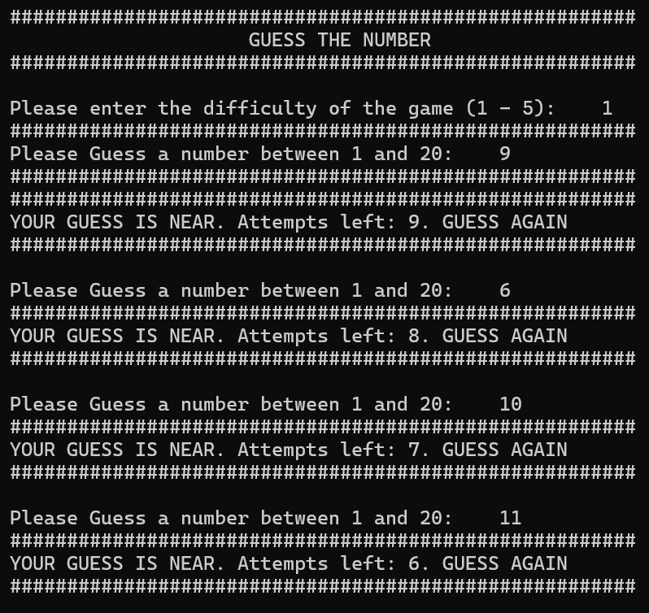
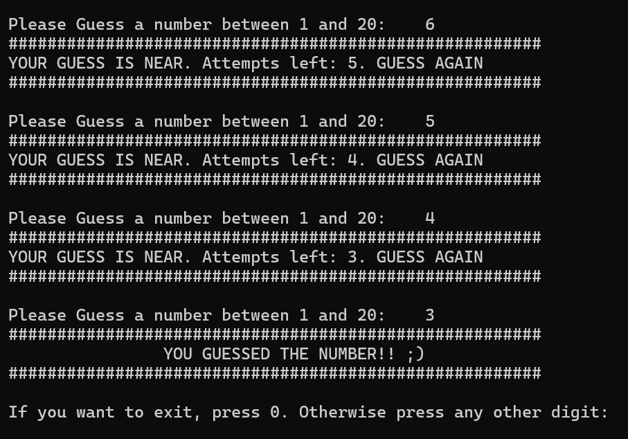

# Guess-Number-Game
This is a guess the number game I made in my free time. It asks the user about the difficuly of the game.

# How to play?
1. Enter the difficulty of the game.
2. Guess a number. If the guess matches the random generated number, user wins.
3. If the number does not match and the difference between number and guess is greater than 10, it shows guess is far.
4. Otherwise it shows guess is near.
5. User have only a limited number of attempts.
6. After the game ends, press 0 to end the program, press any other digit to replay.

# Screen Shots

